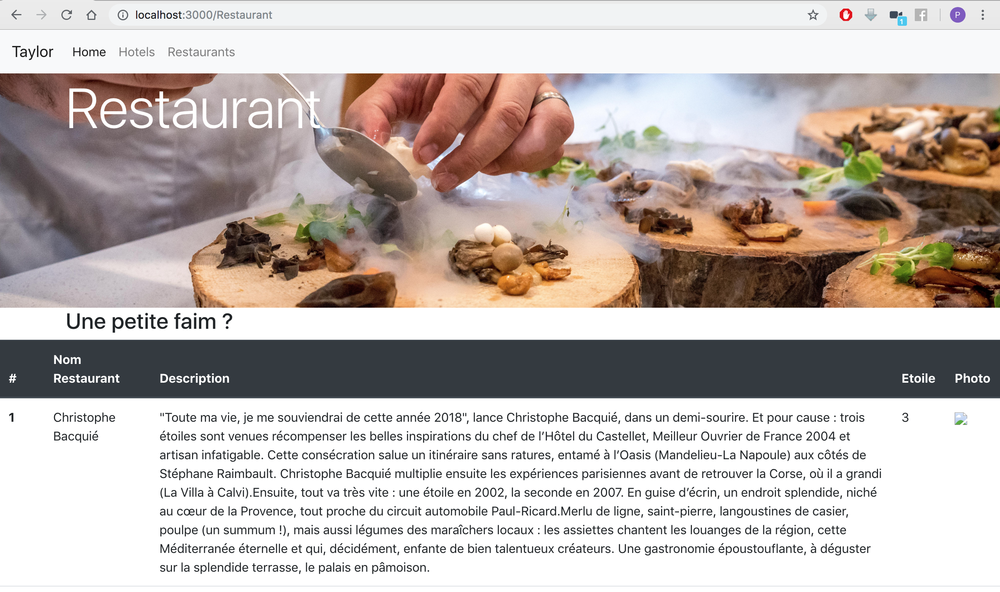

# Rapport Castle ALAÏS Quentin

> Sleep well with Relais & Châteaux

## Scraping Relais et chateau

Pour pouvoir rédcuperer les données du site relais et chateau nous avions 2 possibilités :

- Web scrapping
- API

J'ai chosi d'utiliser la méthode du web scrapping. 

En visionnant des vidéos sur internet je me suis tourné vers la librairie **pupeteer**. 

J'ai pu donc écrire le script **scrap_relais.js** présent dans le git, qui me permet de parcourir l'ensemble des établissements de relais et chateau et d'y récuperer les informations suivantes : 

- Nom du chateau 
- URL du chateau 
- Nom du chef 
- URL restaurant 
- Nom(s) du ou des restaurant

J'ai pu ensuite créer un fichier json qui m'a aidé par la suite à générer le nouveau site. 

## Scraping Michelin

Pareil que pour relais et chateau j'ai appliqué la même méthode pour récuperer les données. 

A ce stade du projet, j'ai cherché à récuperer le plus d'informations possible sur les restaurants de manière à pouvoir créer un site internet le plus propre possible. 

J'ai ainsi pu récuperer les informations suivantes : 

- URL Restaurant 
- Nom restaurant 
- Etoile 
- Description 
- Rue 
- Code postal
- Path Photo

Le "path photo" correspond à l'adresse vers une photo d'illutration de du restaurant michelin que j'ai capturé grace à la librairie **pupetteer** et ensuite stocké dans un fichier **images**.

## Récupétation des des weekend et prix

Je n'ai eu réellement connaissances du besoin de récuperer le prix des weekend qu'après avoir terminé les deux premières étapes. 

J'ai du alors revenir sur chacunes d'elle pour pouvoir adapter en conséquence. 

L'ensemble du procesus du code est décris dans le script **date.js** qui contient la fonction prixdate() et me permer de retourner et d'afficher la date et les prix des samedi selon **l'url du restaurant et le mois**.

## Création du site en React

Pour cette partie j'ai du beaucoup me documenter pour comprendre et pouvoir utiliser react pour créer mon site internet. 

J'ai rencontré de nombreuses difficultés et recommencé plusieurs fois le site de zéros. 

Le site est composé de trois pages : 

- Acceuil : 

- Hotel : 

- Restaurant : 

